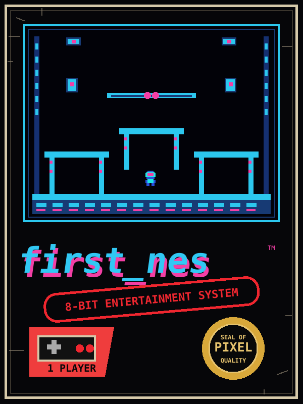

# first_nes

`first_nes` is a small Nintendo Entertainment System project written in 6502 assembly language. I started it in 2018 as a way to learn how an NES program fits together, and the project is still intended to be read, changed, rebuilt, and experimented with.

You do **not** need prior NES-development or assembly-language experience to work through it. The code and documentation are deliberately verbose so that the hardware does not have to feel like a black box.

[](https://github.com/gregkrsak/first_nes/actions/workflows/makefile.yml)
[](../first_nes.s)
[](https://github.com/cc65/cc65/releases/tag/V2.19)

<p align="center">
  
</p>

The included demo is a single-screen platformer. You can walk left and right, make short or full jumps, land on platforms, and inspect the assembly code responsible for the movement, graphics, controller input, collision, and physics.

## Build and run

You will need:

- **GNU Make** to run the build instructions in the `Makefile`.
- **cc65**, which provides the `ca65` assembler and `ld65` linker used by this project.
- **An NES emulator**, such as Nestopia UE or Mesen, to run the resulting ROM.
- **Python 3** if you want to run the included ROM validator.

### 1. Make sure cc65 is installed

The two commands the build actually needs are `ca65` and `ld65`.

```bash
ca65 --version
ld65 --version
```

On macOS with Homebrew:

```bash
brew install cc65
```

On Linux or BSD, cc65 may be available through your package manager, or you can build it from the [cc65 project](https://github.com/cc65/cc65). On Windows, cc65 can be used from a development environment such as MSYS2 or another shell that provides `make`.

### 2. Build the ROM

From the repository directory:

```bash
make
```

A successful build creates:

```text
first_nes.nes
```

That `.nes` file is the game ROM you open in an emulator.

You can also run the structural check:

```bash
make validate
```

A successful validation currently reports a 16 KiB PRG ROM, an 8 KiB CHR ROM, mapper 0 (NROM), and vertical mirroring.

### 3. Run it

Open `first_nes.nes` in your NES emulator.

| Control | Action |
| --- | --- |
| D-pad Left / Right | Walk |
| A | Jump |
| Tap A | Short jump |
| Hold A | Full jump |

B, Up, Down, Select, and Start are currently unused by the demo.

## If NES development is new to you

An NES program is small enough that you can still see most of the important pieces directly. This project intentionally keeps those pieces visible.

Here are the main terms used throughout the source:

| Term | Plain-language meaning |
| --- | --- |
| CPU | The Ricoh 2A03 processor that runs the game's 6502 machine code |
| PPU | The Picture Processing Unit that draws backgrounds and sprites |
| APU | The Audio Processing Unit that produces sound |
| ROM | The cartridge data loaded by the emulator or console |
| PRG ROM | Program bytes: executable code and other CPU-visible ROM data |
| CHR ROM | Graphics tile data used by the PPU |
| NROM / mapper 0 | The simplest common NES cartridge layout; no bank switching |
| Nametable | A 32×30 map of background tile numbers for one screen |
| Palette | The small table of NES color selections used by backgrounds and sprites |
| Sprite | A movable hardware graphic; the NES supports 64 entries in OAM |
| OAM | Object Attribute Memory, where sprite position, tile, and attribute data live |
| Vblank | The short period between displayed frames when PPU updates are normally performed |
| NMI | The interrupt the PPU can generate at the start of vblank |
| Emulator | Software that behaves like an NES so the ROM can run on a modern computer |

The current cartridge layout is intentionally simple: **one 16 KiB PRG bank, one 8 KiB CHR bank, mapper 0, vertical mirroring**.

## If assembly language is new to you

Assembly is much more literal than most modern programming languages. Most source lines correspond closely to one CPU instruction or one piece of data.

A few conventions will make the files much easier to read:

| Syntax | Meaning |
| --- | --- |
| `$20` | A hexadecimal number (`$20` is decimal 32) |
| `%10000000` | A binary number, useful when individual bits matter |
| `#value` | Use the value itself rather than treating it as a memory address |
| `; comment` | Everything after the semicolon is a comment |
| `Label:` | A named location that code can jump to or data can refer to |
| A | The accumulator, the 6502's main arithmetic/data register |
| X / Y | The two 6502 index registers |

Some common instructions in this project are:

| Instruction | What it does |
| --- | --- |
| `LDA` | Load a value into the A register |
| `STA` | Store A into memory |
| `LDX` / `LDY` | Load X or Y |
| `INC` / `DEC` | Increase or decrease a memory value |
| `CMP` | Compare A with another value and set CPU flags |
| `BEQ` / `BNE` | Branch if the previous result was equal / not equal |
| `BCC` / `BCS` | Branch based on the CPU carry flag |
| `JMP` | Jump to another location |
| `JSR` | Call a subroutine |
| `RTS` | Return from a subroutine |
| `PHA` / `PLA` | Push A onto the stack / pull it back |

You will also see **ca65 assembler directives**. These are instructions to the assembler rather than instructions executed by the NES CPU:

| Directive | Purpose |
| --- | --- |
| `.BYTE` | Put literal byte values into the ROM |
| `.PROC` / `.ENDPROC` | Mark the start and end of a named procedure |
| `.INCLUDE` | Insert another assembly source file here |
| `.SEGMENT` | Select a linker-defined region such as code, palette data, or CHR data |
| `.RES` | Reserve bytes of RAM |

For example, the horizontal movement code is intentionally straightforward: it loads the player's X position, checks the screen boundary, changes the position by one pixel, and remembers which direction the character is facing. The comments in the source are deliberately verbose so you can follow those steps instruction by instruction.

## Where should I start reading?

If you are new to this kind of project, do not start by reading every file from top to bottom. A more useful order is:

1. **`first_nes.s`** — shows how the pieces are assembled into one ROM.
2. **`lib/isr/poweron_reset.s`** — shows what happens when the NES starts.
3. **`lib/game/main_loop.s`** — shows what happens once per game frame.
4. **`lib/shared_code/controllers.s`** — shows how controller buttons are read.
5. **`lib/sprite/basic_movement.s`** — small, approachable movement routines.
6. **`lib/game/physics.s`** — jump velocity and gravity.
7. **`lib/game/platform_collision.s`** — platform support and landing checks.
8. **`lib/sprite/animation.s`** — chooses sprite frames and left/right facing.

Then use the data files under `data/` to see how palettes, sprites, backgrounds, and CHR graphics are represented as bytes.

## How one frame works

The program keeps interrupt-time work short and performs ordinary game logic in the foreground loop.

```text
PPU begins vertical blank
        |
        v
NMI copies the $0200 OAM shadow page to PPU OAM
        |
        v
NMI increments FrameCounter and returns
        |
        v
MainLoop sees a new frame
        |
        +--> read controller
        +--> move left/right
        +--> check support and jump input
        +--> apply gravity
        +--> resolve platform landing
        +--> choose animation frame
        +--> write the next sprite state into the OAM shadow page
```

The distinction is important: the game keeps a logical player position in RAM, and the OAM shadow page is used to draw that state. The sprite hardware is not being used as the game's authoritative physics state.

## Platformer physics

The demo uses a few small techniques that make the controls more forgiving without making the code difficult to inspect:

- Vertical position and velocity use **8.8 fixed-point values**. One byte represents whole pixels and another represents fractional motion.
- Gravity starts at **+0.25 pixels per frame squared**.
- A full jump begins at **-4.5 pixels per frame**.
- Falling is capped at **+4.0 pixels per frame**.
- **Coyote time** allows a jump for four frames after walking off a ledge.
- **Jump buffering** remembers a slightly early A press for four frames.
- Releasing A while the player is still rising reduces upward velocity, which produces a short jump.

The tuning constants are grouped near the top of `lib/game/physics.s` and `lib/game/jump_assist.s` so they are easy to find while experimenting.

## Project layout

| Path | What you will find there |
| --- | --- |
| `first_nes.s` | Main assembly file that includes the project's code and data and defines the interrupt vectors |
| `config/ines.cfg` | ld65 memory map and ROM layout |
| `data/background/` | 32×30 background nametable and attribute data |
| `data/header/` | iNES header bytes |
| `data/palette/` | NES palette bytes |
| `data/sprites/` | Initial sprite/OAM data |
| `data/tiles/` | Original Neon Ranger and environment CHR graphics |
| `lib/isr/` | Reset, NMI, and IRQ/BRK handlers |
| `lib/shared_code/` | CPU, APU, PPU, and controller support routines/register definitions |
| `lib/game/` | Player state, frame loop, physics, jump assists, and platform collision |
| `lib/sprite/` | Horizontal movement and animation |
| `scripts/validate_rom.py` | Checks the finished ROM's iNES structure |

## Graphics and Neon Ranger

Neon Ranger and the industrial room graphics were created specifically for this project and are distributed under the same license as the rest of `first_nes`.

The character is 16×16 pixels but is built from four 8×8 NES hardware sprites. The animation code reuses and rearranges tiles where practical, and the left-facing character uses the OAM horizontal-flip attribute instead of storing a second full copy of the artwork.

The CHR graphics are kept as readable assembly data in `data/tiles/neon_ranger.inc`. Each NES 8×8 tile uses 16 bytes: eight bytes for the low bit plane followed by eight bytes for the high bit plane. Changing those bytes changes the pixels the PPU draws.

The visible platform locations in `data/background/neon_grid.inc` correspond to the collision surfaces in `lib/game/platform_collision.s`, making it possible to compare the picture on screen directly with the game's collision data.

The box artwork at the top of this README is only presentation art. The sprite geometry inside it is based on the actual Neon Ranger design used by the ROM; it is not additional in-game artwork.

## How the ROM is built

The build process is intentionally ordinary and visible:

```text
first_nes.s
    |
    v
  ca65
    |
    v
first_nes.o
    |
    v
  ld65 + config/ines.cfg
    |
    +--> iNES header
    +--> 16 KiB PRG ROM
    +--> 8 KiB CHR ROM
              |
              v
        first_nes.nes
```

`ca65` turns assembly source into an object file. `ld65` places the resulting code and data into the memory layout described by `config/ines.cfg`. The Makefile then combines the header, PRG, and CHR output into the final `.nes` file.

## ROM validation and GitHub Actions

The repository contains a GitHub Actions workflow that performs the same basic build on GitHub's servers. It uses a pinned **cc65 V2.19** toolchain so the build does not silently change when cc65 development moves forward.

`make validate` checks that the generated ROM has the structure this project expects:

- the `NES` + `$1A` iNES signature;
- one 16 KiB PRG bank;
- one 8 KiB CHR bank;
- mapper 0 / NROM;
- vertical mirroring;
- no trainer;
- no accidental NES 2.0 marker;
- a file length consistent with the header.

Successful GitHub Actions runs also upload the generated `first_nes.nes` file as a build artifact.

## A few safe experiments

Once you have built and run the unmodified ROM, make one small change and rebuild it. That is often the easiest way to learn.

Some places to try:

- Change `COYOTE_FRAMES` in `lib/game/jump_assist.s` from `$04` to `$08` and see how long you can wait after leaving a platform before jumping.
- Change one of the Neon Ranger palette bytes in `data/palette/example.inc`, rebuild, and watch the sprite colors change.
- Change `JUMP_SPEED_HI` / `JUMP_SPEED_LO` only after reading the fixed-point comments in `lib/game/physics.s`; those two bytes form one signed 8.8 value.
- Change a background tile number in `data/background/neon_grid.inc` and see which 8×8 tile appears at that screen position.

## Troubleshooting

### `ca65: command not found` or `ld65: command not found`

cc65 is either not installed or its `bin` directory is not on your `PATH`. Run `ca65 --version` and `ld65 --version` before trying `make` again.

### `make` succeeds, but my emulator still shows the old version

Make sure the emulator is opening the `first_nes.nes` file from the same directory where you just ran `make`. Close and reopen the ROM if the emulator does not automatically reload changed files.

### The ROM builds but does not behave as expected

Start from a clean build and validate the generated file:

```bash
make
make validate
```

If validation passes, the ROM's basic iNES structure is correct and the next place to look is usually the specific code or data you changed.

## Contributing

See [CONTRIBUTING.md](CONTRIBUTING.md) for the project's contribution guidelines.

## History and acknowledgements

I originally wrote `first_nes` in 2018 while studying classic NES-development material. The project has been updated over time, but its purpose remains educational: keep the hardware visible and keep the code approachable.

Important references and influences include:

- the NintendoAge **Nerdy Nights** tutorials by bunnyboy;
- Marat Fayzullin's *Nintendo Entertainment System Architecture*;
- Jeremy Chadwick's *Nintendo Entertainment System Documentation*;
- the [NESdev](https://www.nesdev.org/) community and its current hardware documentation.

Thanks also to earlier contributors and testers, including **@elennick**, **@hxlnt**, **@ericandrewlewis**, **@nortti**, and community members who reported setup and documentation problems over the project's history.

The project license is available in [LICENSE](../LICENSE).
