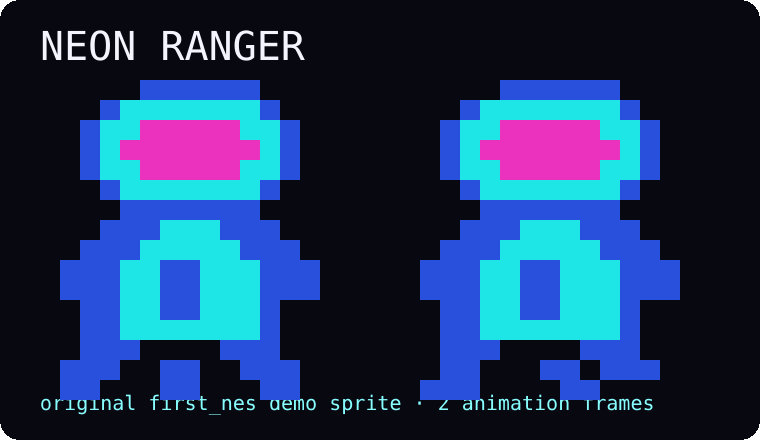

<div align="center">

# 🎮 first_nes

### A tiny, readable NES assembly starter kit

[](../first_nes.s)
[](https://github.com/cc65/cc65/releases/tag/V2.19)
[](https://github.com/gregkrsak/first_nes/actions/workflows/makefile.yml)



**Build a ROM. Explore a neon grid. Read every byte that makes it happen.**

</div>

---

## ✨ What is this?

`first_nes` is a deliberately small Nintendo Entertainment System project for learning how a real NES ROM fits together. It uses the **ca65/ld65** toolchain and targets a simple mapper-0 / NROM-style cartridge layout.

The goal is not to hide the hardware behind an engine. The goal is to make the hardware understandable: reset, PPU startup, palettes, CHR tiles, nametables, OAM DMA, controller polling, interrupts, linker layout, and a frame-synchronized foreground loop are all visible in the source.

The demo character is **Neon Ranger**, an original 16×16 sprite built from four NES hardware sprites. Neon Ranger now moves in all four directions across an original blue/cyan/magenta sci-fi scene, stays inside intentional play-area bounds, and switches between standing and stepping frames while moving.

### 🕹️ Demo controls

| Control | Action |
| --- | --- |
| D-pad ↑ ↓ ← → | Move Neon Ranger |
| Diagonal D-pad combinations | Move diagonally |
| Release D-pad | Return to standing pose |

The full eight-button controller state is still captured every frame, so A, B, Select, and Start are ready for whatever you add next.

## 🧠 What you can learn here

- how a 16-byte iNES header, PRG ROM, and CHR ROM become one `.nes` file;
- how the 6502 reset, NMI, and IRQ/BRK vectors are wired;
- why the PPU needs startup time before normal access;
- how palette data and 2-bit CHR tiles reach the screen;
- how a 32×30 nametable plus attribute data becomes a full background scene;
- how a 256-byte CPU OAM shadow page becomes 64 hardware sprites through DMA;
- how the NES controller's serial A/B/Select/Start/D-pad report becomes one reusable state byte;
- how foreground game logic can synchronize safely to NMI without living inside the interrupt handler;
- how simple bounds and animation state can be layered onto raw OAM coordinates;
- how ca65 source and an ld65 linker configuration cooperate to place bytes at the exact addresses the NES expects.

## 🚀 Quick start

You need **Git**, **GNU Make**, the **cc65** toolchain, and an NES emulator such as Nestopia UE, Mesen, or another emulator that supports mapper 0 ROMs. Python 3 is optional for building, but is used by the ROM validator.

### Linux / BSD

Install or build cc65 so `ca65` and `ld65` are on your `PATH`, then:

```bash
git clone https://github.com/gregkrsak/first_nes.git
cd first_nes
make
make validate
```

### macOS

With Homebrew:

```bash
brew install cc65
git clone https://github.com/gregkrsak/first_nes.git
cd first_nes
make
make validate
```

### Windows

Install a cc65 distribution plus a `make` implementation, or use a Unix-like development shell such as MSYS2. Once `ca65`, `ld65`, and `make` are on your `PATH`:

```bash
git clone https://github.com/gregkrsak/first_nes.git
cd first_nes
make
make validate
```

The build creates:

```text
first_nes.nes
```

Load that file in your emulator and use the D-pad.

## 🗺️ Project map

```text
first_nes.s                 composition root: assets, libraries, vectors
config/ines.cfg             ld65 memory map and ROM layout
data/background/            original 32x30 Neon Grid nametable + attributes
data/header/                iNES metadata
data/palette/               NES palette bytes
data/sprites/               initial OAM shadow data
data/tiles/                 original CHR tile source
lib/isr/                    reset, NMI, IRQ/BRK handlers
lib/shared_code/            CPU/APU/PPU/controller primitives
lib/game/                   scene loading + frame-synchronized foreground logic
lib/sprite/                 bounded movement + two-frame animation
scripts/validate_rom.py     structural iNES sanity checker
```

## 🎨 Original demo art

The **Neon Ranger** character, its animation frame, and the sci-fi scene tiles in `data/tiles/neon_ranger.inc` were created specifically for `first_nes` in 2026. The full-screen **Neon Grid** scene in `data/background/neon_grid.inc` is original as well. They are distributed under the same project license.

Keeping the CHR graphics and nametable as assembly source is intentional: a learner can open the files, see the bytes, and trace them all the way to what appears on screen.

## 🧩 Build pipeline

The project keeps the ROM build intentionally transparent:

```text
first_nes.s
    │
    ▼
   ca65
    │
    ▼
first_nes.o
    │
    ▼
   ld65 + config/ines.cfg
    │
    ├── iNES header
    ├── 16 KiB PRG ROM
    └── 8 KiB CHR ROM
            │
            ▼
       first_nes.nes
            │
            ▼
   scripts/validate_rom.py
```

No game engine. No mystery ROM packer. Just the pieces the machine actually needs.

## ✅ Reproducible CI

GitHub Actions builds every pushed branch and every pull request targeting `staging` or `master`. CI deliberately pins **cc65 V2.19** rather than cloning an arbitrary future `master` revision.

After building, `make validate` checks the generated ROM for the invariants this starter promises:

- `NES` + `$1A` iNES magic;
- exactly one 16 KiB PRG bank and one 8 KiB CHR bank;
- mapper 0 / NROM;
- vertical mirroring;
- no trainer and no accidental NES 2.0 marker;
- a file length matching the header-described ROM layout.

A successful run uploads `first_nes.nes` as a workflow artifact, so a PR can be inspected without rebuilding it locally.

## 🤝 Contributing

See [CONTRIBUTING.md](CONTRIBUTING.md) before opening a pull request so expectations stay synchronized.

## 🕹️ History & acknowledgements

`first_nes` was written by **Greg M. Krsak** in 2018 and grew out of hands-on study of classic NES development material, including:

- the NintendoAge **Nerdy Nights** tutorials by bunnyboy;
- Marat Fayzullin's *Nintendo Entertainment System Architecture*;
- Jeremy Chadwick's *Nintendo Entertainment System Documentation*;
- the NESdev community and its evolving hardware documentation.

Additional thanks to earlier contributors and testers, including **@elennick**, **@hxlnt**, **@ericandrewlewis**, **@nortti**, and community members who reported setup/documentation issues over the project's history.

For current low-level NES reference material, start with [NESdev](https://www.nesdev.org/).

---

<div align="center">

**Small ROM. Real hardware concepts. Neon pixels. Reproducible builds.** 👾

</div>
